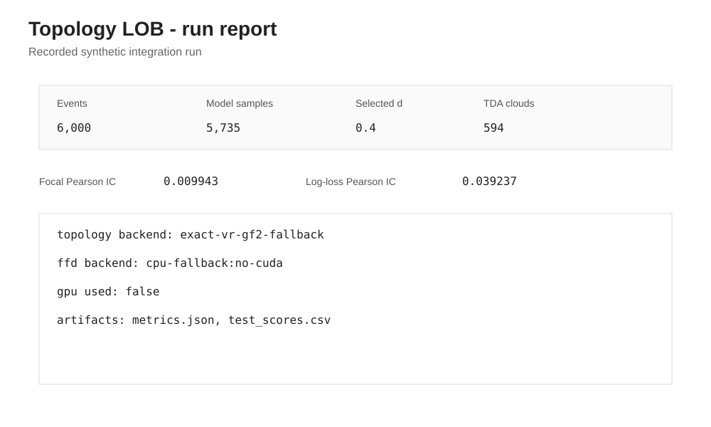
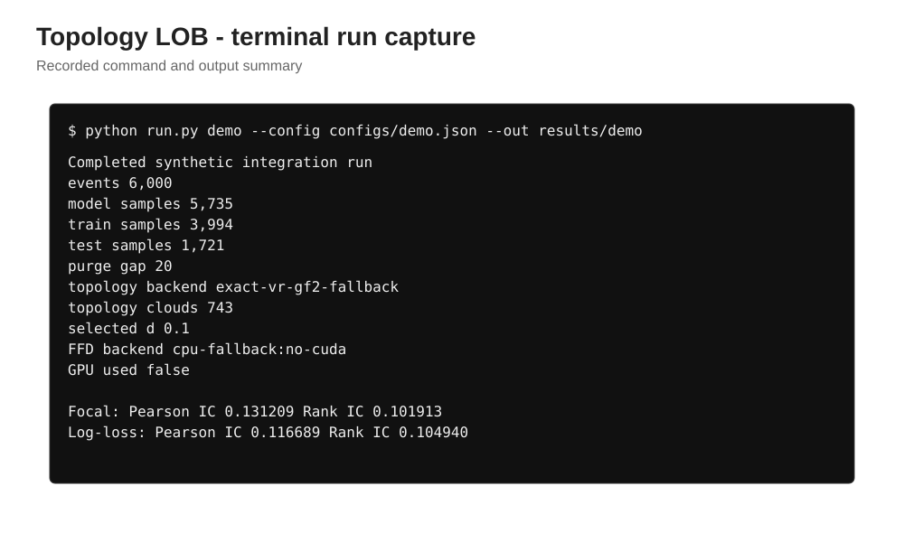

# Topology LOB

<p align="center"></p>

Research code for Level-2 limit-order-book (L2 LOB) liquidity topology, fractional differentiation, and rare-event prediction.

The runnable application is in `research/topology_lob/`. The root repository also contains the upstream codebases referenced by the original project specification; they are kept for provenance and are not required to understand the application layer.

## What is implemented

The application takes L2 snapshots through the following stages:

```
L2 snapshots
    -> schema validation
    -> microstructure features
    -> liquidity-support point clouds
    -> Vietoris-Rips persistent homology (H0/H1)
    -> Betti curves and persistence features
    -> training-only ADF selection of fractional-differencing order
    -> causal fractional differentiation (CUDA/CPU)
    -> training-only class rebalancing
    -> XGBoost with custom binary Focal Loss
    -> chronological purge
    -> out-of-sample metrics
```

The production topology path uses Giotto-TDA. When Giotto-TDA is not installed, the application has an explicitly labelled exact small-cloud Vietoris-Rips fallback over GF(2) for local tests and smoke runs. It is not used when `--require-gtda` is supplied.

## Repository layout

```text
research/topology_lob/
├── configs/                     Example and FI-2010 configurations
├── cpp/                        C++ CPU implementation / benchmark
├── cuda/                       CUDA kernel implementation
├── docs/                       Experiment and real-data run notes
├── scripts/                    FI-2010 conversion and benchmark tools
├── tests/                      Unit and integration tests
├── assets/                     Figures and run-output captures
├── results/                    Result notes; generated run output is ignored
├── run.py                      Command-line entry point
├── topology_lob.py             Core pipeline
├── fi2010.py                  FI-2010 loader / schema adapter
├── pyproject.toml              Pinned Python environment
└── requirements.txt            Pip requirements
```

## Reproduce the project

### 1. Get the code

```bash
git clone https://github.com/SpryzenHell/topology_lob.git
cd topology_lob/research/topology_lob
```

### 2. Use a supported Python

The pinned environment targets Python 3.10-3.12. Python 3.11 is the recommended choice for the documented reproducibility path.

Example with Python 3.11:

```bash
python3.11 -m venv .venv
source .venv/bin/activate
python -m pip install --upgrade pip
```

On Windows PowerShell:

```powershell
py -3.11 -m venv .venv
.\.venv\Scripts\Activate.ps1
python -m pip install --upgrade pip
```

### 3. Install the application

For the complete TDA path and development tests:

```bash
python -m pip install -e ".[tda,dev]"
```

This installs the pinned numerical stack plus Giotto-TDA and pytest.

### 4. Run the test suite

```bash
python -m pytest -q
```

The tests cover L2 schema validation, fractional-difference weights, the exact small-cloud VR fallback, the custom Focal Loss derivatives, and FI-2010 column mapping.

### 5. Run the end-to-end demo

```bash
python run.py demo --config configs/demo.json --out results/demo --require-gtda
```

The command creates:

```text
results/demo/
├── metrics.json
├── test_scores.csv
├── betti_curves.png
├── fractional_stationarity.png
└── index.html
```

Open `results/demo/index.html` in a browser to inspect the run report.

The demo uses deterministic synthetic L2 data. It is intended to exercise the complete code path and is not market data. Any performance number produced by this demo is engineering evidence only.

### 6. Run the ablation and walk-forward checks

```bash
python run.py ablation --config configs/demo.json --out results/ablation
python run.py walk-forward --config configs/demo.json --out results/walk_forward.json
python run.py ffd-benchmark --events 200000 --width 256 --d 0.45
```

These commands keep the same chronological feature/model construction and provide the basic comparison required by the project.

## Real L2 data

The application expects a CSV with one row per L2 snapshot:

```text
timestamp,
bid_price_1,bid_size_1,ask_price_1,ask_size_1,
...
bid_price_N,bid_size_N,ask_price_N,ask_size_N
```

Before feature construction the loader:

- parses timestamps as UTC;
- sorts chronologically;
- requires unique timestamps;
- rejects missing/non-numeric L2 fields;
- rejects negative depth;
- rejects a locked or crossed best bid/ask.

For a real run, use the exact TDA path:

```bash
python run.py demo   --config configs/demo.json   --data /absolute/path/to/l2.csv   --out results/real_l2   --require-gtda
```

For the CUDA fractional-differentiation path, also add `--require-cuda`. The command exits with an error if CUDA is requested but the GPU backend is not actually exercised.

## FI-2010 benchmark

FI-2010 support is included for a public high-frequency LOB benchmark. The benchmark is preprocessed/normalized and is not the original exchange feed. The project therefore treats FI-2010 as a benchmark input and keeps the raw-feed claim separate from it.

The data record is documented separately in `research/topology_lob/DATA_GUIDE.md` and `research/topology_lob/docs/REAL_DATA_RUN.md`.

Typical workflow:

```bash
cd research/topology_lob

python scripts/fetch_fi2010.py   --out data/external/fi2010.zip   --extract

python scripts/run_fi2010_benchmark.py   --train data/external/fi2010/fi2010/Train_Dst_NoAuction_DecPre_CF_7.txt   --test     data/external/fi2010/fi2010/Test_Dst_NoAuction_DecPre_CF_7.txt     data/external/fi2010/fi2010/Test_Dst_NoAuction_DecPre_CF_8.txt     data/external/fi2010/fi2010/Test_Dst_NoAuction_DecPre_CF_9.txt   --tda-stride 1000   --require-gtda   --out results/fi2010_benchmark.json
```

Add `--require-cuda` when the fractional-differentiation GPU path is part of the run being verified.

The benchmark code deliberately constructs forward-return labels separately inside train and each held-out test segment. This prevents an end-of-segment observation from receiving a target calculated from the next segment.

## Reproducibility rules

The repository follows these rules for reported results:

1. The fractional-differencing order is selected from the training prefix only.
2. The fractional-difference filter is causal.
3. Class rebalancing is performed only after the training boundary is fixed.
4. Model fitting never uses the held-out rows.
5. Forward-return labels do not cross train/test or test-day boundaries.
6. The held-out period is chronological and includes a purge gap.
7. Focal Loss is compared with a standard XGBoost binary-logloss control on the same split and features.
8. The value `0.064` is stored only as `target_resume_ic`; it is never substituted for a measured Information Coefficient.

## Figures and run captures

All figures below are generated from measured local runs or from deterministic data generated by the repository. No illustrative market-data images are used as results.

### L2 snapshot used by the deterministic demo


### Vietoris-Rips Betti counts


### Training-only stationarity selection


### Model comparison from the recorded synthetic integration run


### Standalone C++ benchmark


### Run report preview



### Terminal run capture



The assets directory documents the provenance of each figure and capture.

## Verified synthetic run

The current local integration run uses the deterministic synthetic generator and the current application logic. It is included to verify that the code executes from input through feature construction, TDA, fractional differentiation and model evaluation.

| Item | Value |
|---|---:|
| Synthetic events | 6,000 |
| Model rows | 5,735 |
| Training rows | 3,994 |
| Test rows | 1,721 |
| Purge gap | 20 |
| Topology clouds | 743 |
| Selected d | 0.1 |
| TDA backend | exact-vr-gf2-fallback |
| FFD backend | cpu-fallback:no-cuda |

| Metric | Focal Loss | Log-loss control |
|---|---:|---:|
| Pearson IC | 0.131209 | 0.116689 |
| Rank IC | 0.101913 | 0.104940 |
| ROC-AUC | 0.581376 | 0.579952 |
| PR-AUC | 0.263163 | 0.254891 |
| Log loss | 0.501007 | 0.562889 |

The validation machine did not have a CUDA device or Giotto-TDA installed. The exact TDA and CUDA paths are checked by the repository's GitHub Actions workflow; the local figures above are therefore labelled as the CPU/fallback validation record.

## Performance result policy

The repository contains a deterministic synthetic integration result and a standalone C++ CPU benchmark so that the codebase has concrete execution evidence without inventing a market result.

The historical resume target of OOS IC = 0.064 is a reproduction target only. It must be measured on the intended real L2 dataset before being described as an achieved result.

## Third-party code

The original project specification named:

- `giotto-ai/giotto-tda`
- `artemmavrin/focal-loss`
- `scikit-learn-contrib/imbalanced-learn`

The application layer uses the relevant public APIs and documents the upstream sources in `THIRD_PARTY.md`. It does not claim the project-specific orchestration code is part of those upstream repositories.

## Notes

The real-data commands require access to the selected dataset files. Those data files are not committed to this repository. The fetch utility prints the archive SHA-256 so a run can be recorded with an explicit input checksum.
