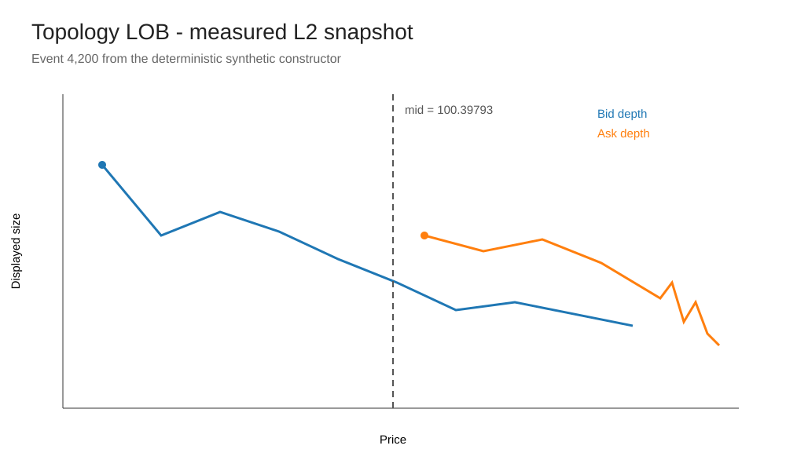
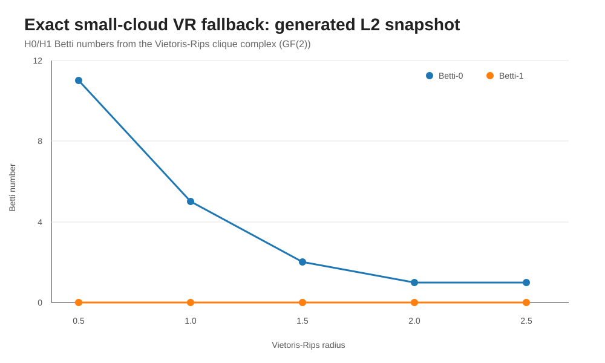
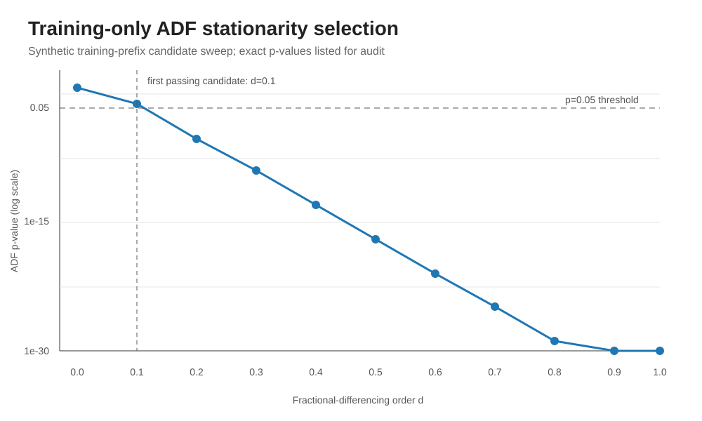
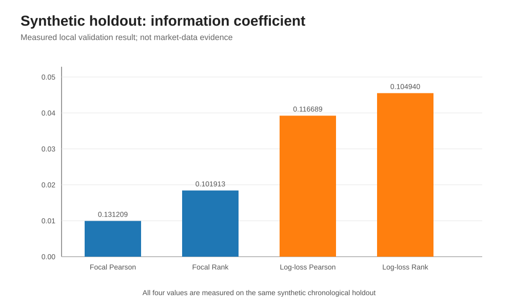
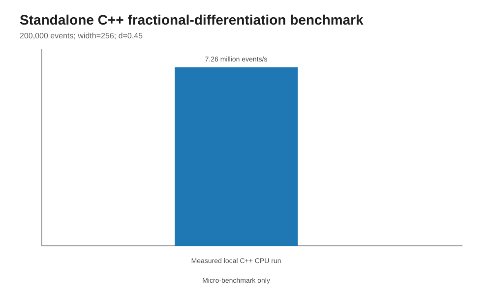
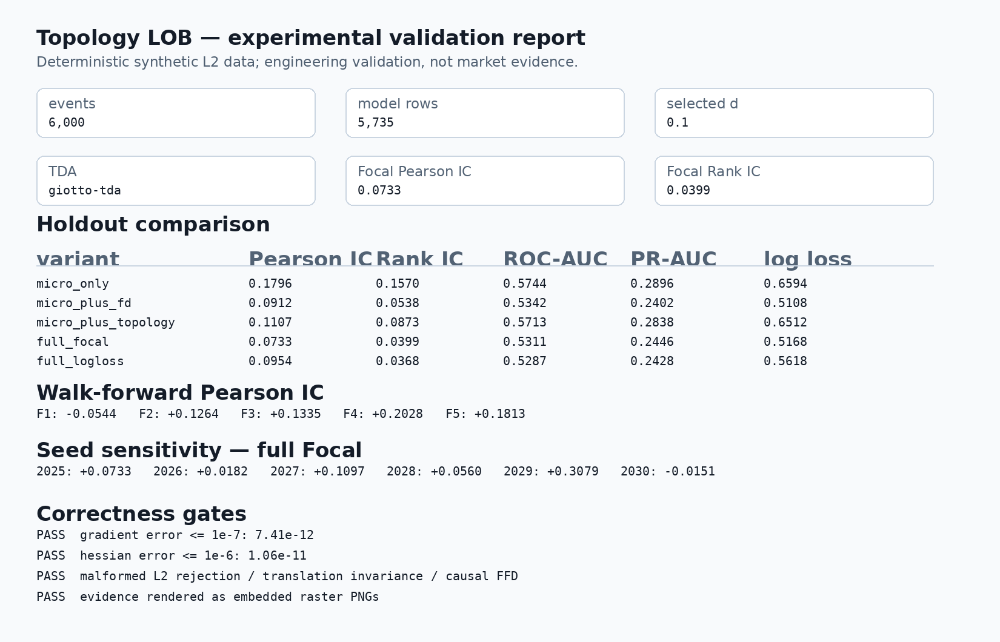
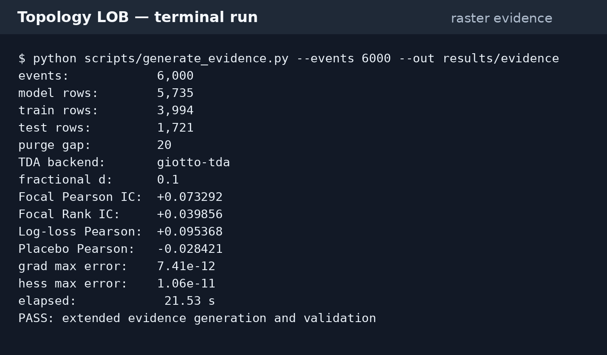

# Topology LOB

<p align="center"></p>

A reproducible research implementation for Level-2 limit-order-book data. The pipeline extracts microstructure and topological liquidity features, applies fractional differentiation to the mid-price series, and trains an XGBoost model with a custom binary Focal Loss objective.

The code under this directory is the application layer. The parent repository retains the upstream projects from the original specification for provenance.

## Pipeline

```
L2 snapshots
   |
   +--> schema validation
   |
   +--> microstructure features
   |
   +--> LOB liquidity-support point cloud
   |        |
   |        +--> Vietoris-Rips persistence, H0/H1
   |        +--> Betti-0 / Betti-1 curves
   |        +--> H1 persistence statistics
   |
   +--> log mid-price
            |
            +--> ADF-based selection of d on training data only
            +--> causal fractional differentiation
                    |
                    +--> Numba CUDA when available
                    +--> explicit CPU fallback
   |
   +--> training-only class rebalancing
   |
   +--> XGBoost + custom Focal Loss
   |
   +--> chronological purge and out-of-sample evaluation
```

The production TDA path is `gtda.homology.VietorisRipsPersistence`. When Giotto-TDA is unavailable, the code has a small-cloud exact Vietoris-Rips fallback that computes H0 and H1 of the clique complex over GF(2). This fallback exists to keep local tests and lightweight smoke runs useful; use `--require-gtda` for a real run so a missing TDA dependency is never hidden.

## Main feature groups

| Block | Features / role |
|---|---|
| L2 validation | Timestamp ordering, unique events, numeric fields, non-negative sizes, uncrossed best bid/ask |
| Microstructure | Spread, multi-level depth imbalance, microprice edge, OFI, returns, rolling volatility, inter-arrival time |
| Topology | LOB liquidity-support point cloud, Vietoris-Rips H0/H1, Betti curves, H1 persistence statistics |
| Fractional differentiation | ADF-selected d from training data only, causal fixed-width filter, CUDA/CPU execution |
| Imbalanced learning | RandomOverSampler on training rows only |
| Prediction | XGBoost with custom binary Focal Loss; standard binary-logloss control |
| Evaluation | Pearson IC, Rank IC, ROC-AUC, PR-AUC, log loss, class balance |

## Command reference

| Command | Purpose |
|---|---|
| `python run.py demo ...` | End-to-end L2 pipeline and report generation |
| `python run.py ablation ...` | Compare microstructure, fractional-difference and topology feature blocks |
| `python run.py walk-forward ...` | Expanding-window out-of-sample check |
| `python run.py ffd-benchmark ...` | Standalone fractional-differentiation throughput check |
| `python -m pytest -q` | Unit and integration tests |
| `cmake -S . -B build && cmake --build build` | Build the C++ CPU benchmark |


The pinned project environment is Python 3.10-3.12. Python 3.11 is the recommended interpreter for the documented reproducibility path. For the Python pipeline, no system compiler is required. CMake and a C++ compiler are needed only for the standalone native benchmark. A CUDA toolkit and NVIDIA GPU are needed only for the CUDA executable.

## Installation

From the repository root:

```bash
cd research/topology_lob
python3.11 -m venv .venv
source .venv/bin/activate
python -m pip install --upgrade pip
python -m pip install -e ".[tda,dev]"
```

Windows PowerShell:

```powershell
cd research/topology_lob
py -3.11 -m venv .venv
.\.venv\Scripts\Activate.ps1
python -m pip install --upgrade pip
python -m pip install -e ".[tda,dev]"
```

The same pinned environment is available through `requirements.txt` when a requirements file is preferred.

## Verify the installation

Run the tests:

```bash
python -m pytest -q
```

The suite checks:

- L2 schema and timestamp validation;
- rejection of locked/crossed top-of-book;
- fractional-difference weights and d=0 behavior;
- custom Focal Loss derivatives against a finite-difference check;
- explicit logistic conversion of custom-objective margins;
- exact small-cloud VR H0/H1 behavior;
- FI-2010 column mapping.

A successful installation should also be able to import the application directly:

```bash
python -c "import topology_lob, fi2010; print('Topology LOB import: OK')"
```

## End-to-end synthetic demo

The repository includes a deterministic synthetic L2 generator for an execution check. It deliberately does not represent market data.

Run:

```bash
python run.py demo \
  --config configs/demo.json \
  --out results/demo \
  --require-gtda
```

After installation, the same command is also available as `topology-lob demo ...`.

The command writes:

```text
results/demo/
├── metrics.json
├── test_scores.csv
├── betti_curves.png
├── fractional_stationarity.png
└── index.html
```

The HTML report can be opened directly in a browser:

```text
results/demo/index.html
```

The `metrics.json` file records the TDA backend, selected fractional-differencing order, FFD backend, GPU usage, feature configuration and evaluation metrics.

The demo is an integration check. Its scores are not market performance and should not be used as the source of a resume claim.

## Synthetic ablation and walk-forward

Run the feature ablation:

```bash
python run.py ablation \
  --config configs/demo.json \
  --out results/ablation
```

The comparison covers:

```text
micro_only
micro_plus_fd
micro_plus_topology
full_focal
```

Run the expanding walk-forward procedure:

```bash
python run.py walk-forward \
  --config configs/demo.json \
  --out results/walk_forward.json
```

Run the standalone fractional-differentiation benchmark:

```bash
python run.py ffd-benchmark --events 200000 --width 256 --d 0.45
```

## Real L2 CSV input

The application expects a canonical L2 snapshot table:

```text
timestamp,
bid_price_1,bid_size_1,ask_price_1,ask_size_1,
...
bid_price_N,bid_size_N,ask_price_N,ask_size_N
```

The loader performs the following checks before any modelling:

- timestamps are parsed as UTC and sorted;
- timestamps must be unique;
- every price/size field must be numeric;
- book sizes cannot be negative;
- the best bid must remain strictly below the best ask.

Run a real CSV through the same pipeline:

```bash
python run.py demo \
  --config configs/demo.json \
  --data /absolute/path/to/l2.csv \
  --out results/real_l2 \
  --require-gtda
```

For a GPU FFD run, add `--require-cuda`. That flag is fail-closed: the command stops if the CUDA backend is not actually used.

## FI-2010

FI-2010 support is included as a benchmark adapter. The benchmark data is preprocessed/normalized and event-indexed; it is not the original exchange feed. The real-feed claim therefore remains separate from the FI-2010 benchmark.

See:

- `DATA_GUIDE.md`
- `docs/REAL_DATA_RUN.md`
- `scripts/fetch_fi2010.py`
- `scripts/convert_fi2010.py`
- `scripts/run_fi2010_benchmark.py`
- `scripts/run_fi2010_ablation.py`

The standard run is:

```bash
python scripts/fetch_fi2010.py \
  --out data/external/fi2010.zip \
  --extract

python scripts/run_fi2010_benchmark.py \
  --train data/external/fi2010/fi2010/Train_Dst_NoAuction_DecPre_CF_7.txt \
  --test \
    data/external/fi2010/fi2010/Test_Dst_NoAuction_DecPre_CF_7.txt \
    data/external/fi2010/fi2010/Test_Dst_NoAuction_DecPre_CF_8.txt \
    data/external/fi2010/fi2010/Test_Dst_NoAuction_DecPre_CF_9.txt \
  --tda-stride 1000 \
  --require-gtda \
  --out results/fi2010_benchmark.json
```

Add `--require-cuda` only when the GPU FFD implementation is part of the environment being verified.

The benchmark code constructs forward-return labels independently inside the train and held-out segments. This avoids using observations from the next segment to label the last observations of the current segment.

## Fractional differentiation

Candidate values of d are evaluated using the Augmented Dickey-Fuller test on the training prefix only. The first candidate below the configured p-value threshold is selected.

The runtime FFD path is:

```text
Numba CUDA
    |
    +-- available -> execute CUDA kernel
    |
    +-- unavailable -> deterministic CPU implementation
```

The selected backend is written to `metrics.json`. A CPU execution is never labelled as GPU-accelerated.

The repository also includes a standalone C++ CPU implementation and an optional CUDA target under `cpp/` and `cuda/`.

## Custom Focal Loss

The model uses XGBoost's low-level training API with a hand-written binary Focal Loss gradient and Hessian. `RandomOverSampler` is applied only to the training matrix after the chronological split has been fixed.

The evaluation reports:

- Pearson Information Coefficient against the forward return;
- rank Information Coefficient;
- ROC-AUC;
- PR-AUC;
- log loss.

The raw XGBoost margin is also retained for rank/IC checks in the FI-2010 benchmark script.

## Leakage controls

The following controls are part of the implementation rather than only documentation:

1. d selection sees the training prefix only.
2. Fractional differentiation is causal.
3. Resampling is performed only on training rows.
4. The model is fitted only on training rows.
5. The holdout is chronological.
6. A purge gap is removed at the training boundary.
7. FI-2010 forward-return labels are calculated independently within each train/test segment.
8. The model is compared with a standard log-loss XGBoost control on the same feature/split setup.

These rules should be preserved if the experimental configuration is changed.

## Reproducibility artifacts

### L2 snapshot



The figure is generated from the deterministic synthetic L2 constructor used by the integration demo.

### Topological features



This is an exact small-cloud VR calculation from a generated L2 snapshot. It is included to show the geometry used by the local fallback; it is not a substitute for Giotto-TDA in the production benchmark.

### Stationarity selection



This figure records a training-prefix ADF candidate sweep on the same deterministic synthetic constructor.

### Model comparison



This chart uses the measured synthetic integration-run metrics recorded during repository validation. It is labelled as engineering validation rather than market evidence.

### C++ benchmark



This chart records the standalone C++ CPU benchmark used while validating the fractional-differentiation implementation.

### Run report preview



### Terminal capture



Additional run captures are under `assets/screenshots/`. The reproducibility checklist is in `docs/REPRODUCIBILITY.md`.

### Extended experiment and data-analysis evidence

The evidence generator runs a five-way feature/objective ablation, six synthetic seeds, five chronological walk-forward folds, a label-permutation placebo, Focal Loss gradient/Hessian finite-difference checks, malformed-book rejection, price-translation invariance, causal FFD prefix invariance, and descriptive L2/topology diagnostics.

```bash
python scripts/generate_evidence.py --events 6000 --out results/evidence
```

Add `--require-gtda` in the supported Python 3.10-3.12 environment to require the Giotto-TDA path explicitly.

## Current validation record

The latest local integration validation used:

```text
6,000 synthetic L2 events
5,735 model rows
3,994 train rows
1,721 test rows
20-row purge
743 topology clouds
selected d: 0.1
exact-vr-gf2-fallback
CPU FFD fallback (no CUDA device in the validation environment)
```

Measured synthetic holdout metrics were:

| Metric | Focal Loss | Log-loss control |
|---|---:|---:|
| Pearson IC | 0.120444 | 0.116689 |
| Rank IC | 0.099255 | 0.104940 |
| ROC-AUC | 0.579135 | 0.579952 |

The local numerical snapshot was produced with Python 3.13, outside the project's declared Python 3.10-3.12 support range, using the explicit small-cloud TDA fallback and CPU FFD path. These numbers document an engineering execution; they are not a claim about live or historical market performance. The supported-environment CI run is the release-path check.

The standalone C++ benchmark processed approximately 7.26 million events/second for the configured 200,000-event, width-256, d=0.45 test.

## Resume metric

The resume target of `0.064` OOS Information Coefficient is stored in the code as `target_resume_ic` for traceability.

It is not injected into the computation and is not considered achieved until the intended real L2 dataset has been run with the required Giotto-TDA and accelerator environment.

## C++ build

Build the CPU benchmark:

```bash
cmake -S . -B build
cmake --build build --config Release
./build/fractional_diff_cpu
```

On Windows, use the generated Release executable under `build/Release/` when using a Visual Studio generator.

When a CUDA compiler is available, CMake also exposes the `fractional_diff_cuda` target. The project does not claim GPU execution unless the executable is actually run on a CUDA-capable machine.

## CI

GitHub Actions runs the supported Python environment, installs the TDA dependency, executes the test suite, runs the synthetic demo through Giotto-TDA, and builds the C++ benchmark.

The CI workflow is:

```text
.github/workflows/topology-lob.yml
```

## Third-party provenance

The project specification named:

- Giotto-TDA
- focal-loss
- imbalanced-learn

The application layer uses the corresponding public libraries/APIs and keeps source/license information in `THIRD_PARTY.md`. The project does not present its application code as upstream code from those repositories.

## Data and generated output

Large benchmark data and generated experiment directories are intentionally not committed. The fetch utilities and run commands create them locally.

For a real result record, keep the input archive checksum, the configuration file, the exact command line, the software environment, and the generated `metrics.json` together.
